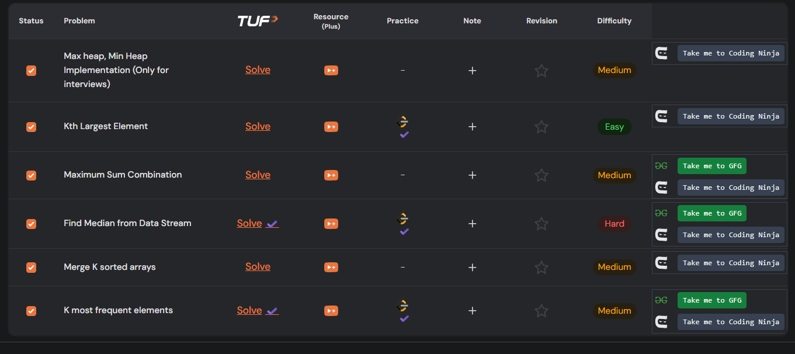
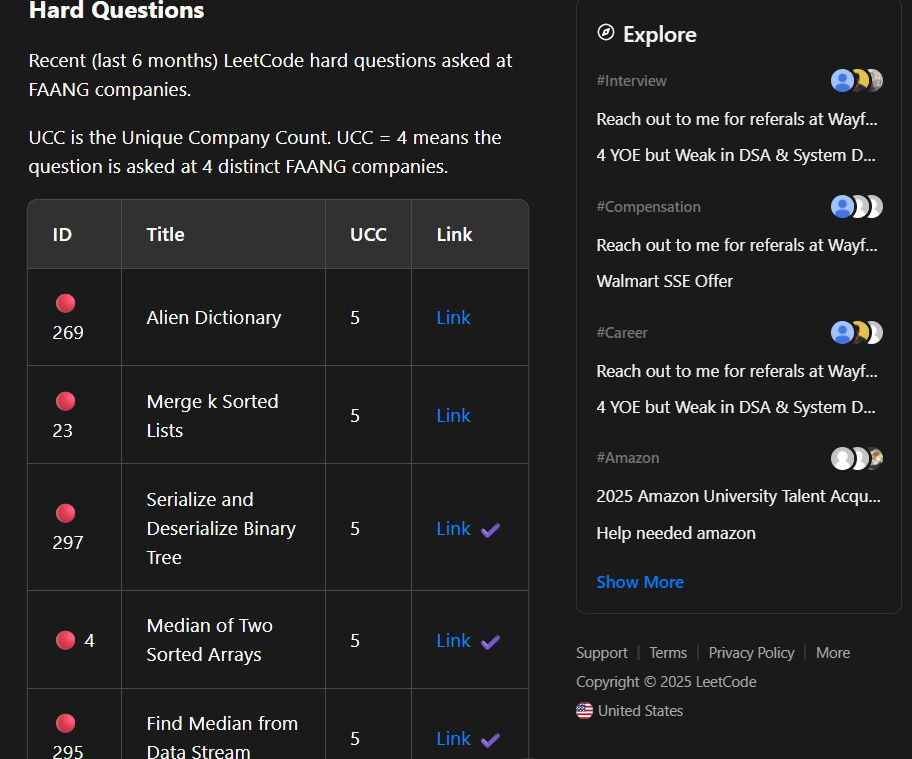

# LeetCode Auto Ticker

## What if you had a tool that could tick the problems you solved on leetcode in the UI of any website?

LeetCode Auto Ticker is a Chrome extension that automatically marks (✔️) the LeetCode problems you've solved, directly in the UI of any websites—including Take U Forward sheets and any site with LeetCode problem links or sheets.

### Features
- Automatically ticks solved LeetCode problems on any website
- Enhanced UI for Take U Forward sheets: shows quick access buttons to GFG and Coding Ninja solutions
- Click on the extension logo in the extension bar to refresh the solved status
- No popup required—just install and enjoy
- No login or leetcode id required to be set up

### How It Works
- The extension tracks your solved problems and updates the UI wherever LeetCode problem links appear
- For Take U Forward sheets, it fetches backend data and displays GFG and Coding Ninja Links too
- Works seamlessly on LeetCode Discuss, blogs, and more

### Demo

### Installation
1. Clone or download this repository
2. Go to `chrome://extensions` in your browser
3. Enable Developer Mode
4. Click "Load unpacked" and select the folder

### Usage
- Make sure you are logged in to LeetCode in your browser for the extension to work correctly
- Browse any supported site
- Solved problems will be ticked automatically

### License
MIT
